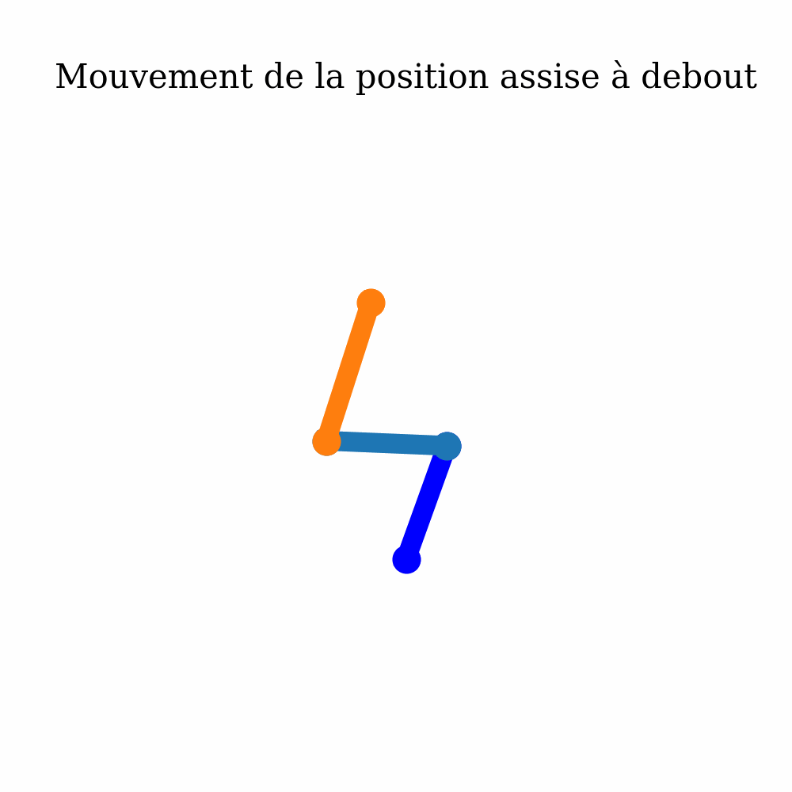

# Exoskeleton legs Simulation - 2021 / 2022

## Table of contents
1. [General Information](#general-info)
2. [Technologies](#technologies)
3. [Files Organisation](#organisation)

***
<a name="general-info"></a>
## General Informations

This project is part of a study carried out in a group for work in school preparation. It is project is a simulation of a leg exoskeleton. This part is a simulation of the exoskeleton Atalante, developed by the company [Wandercraft](https://www.wandercraft.eu/articles/wandercraft-equipe-henri-mondor-dun-exosquelette-atalante-grace-au-collectif-protegetonsoignant#:~:text=Pionnier%20de%20la%20robotique%20dynamique,les%20stades%20de%20la%20r%C3%A9%C3%A9ducation.).

The simulation is based on the study of the exoskeleton, which is available in the [documents](/documents/E3A-PSI-2019-ExosqueletteAtalante-Sujet.pdf) folder. All the sources of the project are written in French, but the algorithm is in English and commented in French. This subject is available on the [Upsti](https://www.upsti.fr/espace-etudiants/annales-de-concours/topics/e3a-psi-2019-exosquelette-atalante) website. The simulation is based on the algorithm of the study but aims to go further in the study and simulate the movement of the exoskeleton and all the forces acting on it.

A large part of the algorithms is based on the work of Marc BUFFAT on the [modeling of a robot arm with sympy](https://perso.univ-lyon1.fr/marc.buffat/2019/Robotique_Bras2D/index.html#Etude-statique-du-bras-de-robot). This work has been reinterpreted and adapted for the simulation of the leg exoskeleton.

***
<a name="technologies"></a>
## Technologies

A list of technologies used within the project:
* [Python](https://www.python.org/): Version 3.9.1
* [Numpy](https://numpy.org/): Version 1.19.2
* [Scipy](https://www.scipy.org/): Version 1.5.2
* [Sympy](https://www.sympy.org/en/index.html): Version 1.7.1
* [Matplotlib](https://matplotlib.org/): Version 3.3.2
* [IPython](https://ipython.org/): Version 7.19.0

***
<a name="organisation"></a>
## Files Organisation

The project is organised as follow:
```
├── calcul_dichoto.py
├── simulation.py
├── animation.gif
├── documents
│   ├── E3A-PSI-2019-ExosqueletteAtalante-Sujet.pdf
│   ├── Exoskeleton_study_summary_FR.pdf
│   ├── Exoskeleton_study_FR.pdf
│   ├── Algorithm.pdf
│   ├── Algorithme_FR.pdf
╵   └── Basic_functions_Sympy_Scipy_Numpy_FR.pdf
```

### [```calcul_dichoto.py```](/calcul_dichoto.py)
This file contains the dichotomy algorithm to find the angle of the knee joint. This algorithm is made to solve one of the question of the [subject](/documents/E3A-PSI-2019-ExosqueletteAtalante-Sujet.pdf).
#

### [```simulation.py```](/simulation.py)
This file contains the simulation of the exoskeleton. This simulation is made to simulate the movement of the exoskeleton and computing some of the forces acting on it. You can uncomment the line 136 to 139 if you want to save again the animation as a gif.
#

### [```animation.gif```](/animation.gif)
This file is the animation of the simulation. This animation is made to show the movement of the exoskeleton.


#

### [```documents```](/documents/)
This folder contains all the documents of the study of the exoskeleton. This study is made to understand the exoskeleton and to find the algorithm to simulate it.
#

### [```E3A-PSI-2019-ExosqueletteAtalante-Sujet.pdf```](/documents/E3A-PSI-2019-ExosqueletteAtalante-Sujet.pdf)
This file is the subject of the study of the exoskeleton. This subject is a subject of competitive admission to French engineering schools, specializing in Engineering Sciences and Computer Science dating from 2019.
#

### [```Exoskeleton_study_summary_FR.pdf```](/documents/Exoskeleton_study_summary_FR.pdf)
This file is the summary of the study we made of the exoskeleton proposed in the subject. It follow the same structure as the subject. It is written in French.
#

### [```Exoskeleton_study_FR.pdf```](/documents/Exoskeleton_study_FR.pdf)
This file is the study we made of the exoskeleton proposed in the subject. It respond to all the questions of the subject of the part that is concerned with moving from sitting to standing. It is written in French.
#

### [```Algorithm.pdf```](/documents/Algorithm.pdf)
This file is a representation of the algorithm we made to simulate the exoskeleton and is written in English.
#

### [```Algorithme_FR.pdf```](/documents/Algorithme_FR.pdf)
This file is the same as the previous one but is written in French.
#

### [```Basic_functions_Sympy_Scipy_Numpy_FR.pdf```](/documents/Basic_functions_Sympy_Scipy_Numpy_FR.pdf)
This file is a summary of the basic functions of the libraries used in the project and is written in French.
